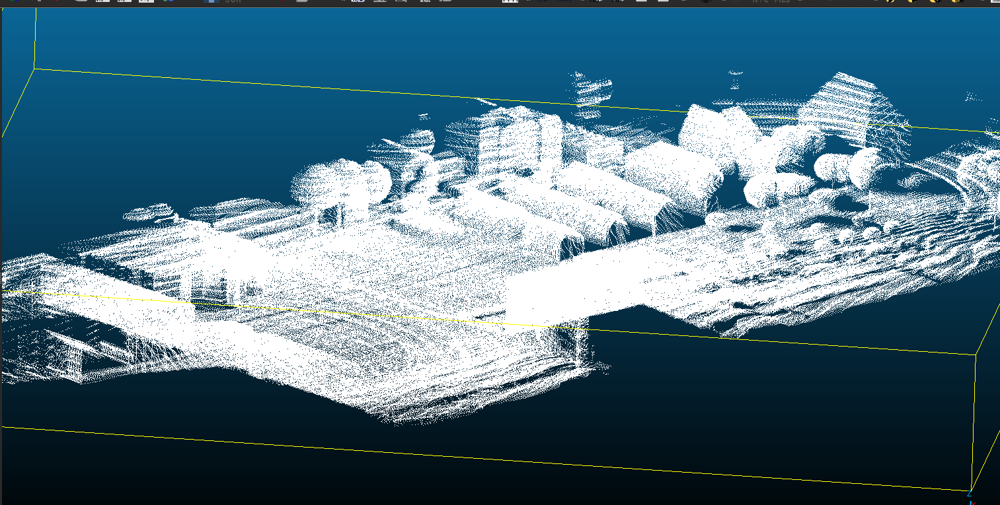

# UAV-Threat-Detection-And-Neutralization


An advanced UAV which can auto detect the intruder with computer vision and lidar sensors to map  around the near by restricted area and give up the alaram for Threat near by


# Autonomous Drone Landing Mission POC

This project implements a simulated autonomous drone mission using **ROS 2 Humble**, **PX4 Autopilot**, and **Gazebo**.


## Project Architecture

*   **Simulation Environment:** Gazebo (Garden/Harmonic) via `ros_gz_sim`.
*   **Flight Control:** PX4 Autopilot running in SITL (Software In The Loop) mode.
*   **Communication Bridge:** Micro-XRCE-DDS-Agent bridging PX4 (uORB) and ROS 2 topics.
*   **Mission Logic:** A custom ROS 2 Python node (`mission_control.py`) that sends trajectory setpoints and high-level commands (Arm, Takeoff, Land).

## Prerequisites

Runs on either combination. **Ubuntu 24.04 + Jazzy is recommended** — it is the pairing
officially tested with Gazebo Harmonic. See [docs/JAZZY_MIGRATION.md](docs/JAZZY_MIGRATION.md).

| | Recommended | Also supported |
| --- | --- | --- |
| Ubuntu | 24.04 | 22.04 |
| ROS 2 | Jazzy | Humble |
| Gazebo | Harmonic | Harmonic |
| `ros_gz` bridge | `ros-jazzy-ros-gz-bridge` | `ros-humble-ros-gz`**`harmonic`**`-bridge` |

Plus, on either: the PX4 Autopilot toolchain (built **natively**, never in Docker) and
Micro-XRCE-DDS-Agent.

> On Humble the stock `ros-humble-ros-gz-bridge` targets Gazebo *Fortress*. It will
> connect to Harmonic, list every topic, and deliver **no data**. You must install the
> `gzharmonic` variant instead. Jazzy needs no such workaround.

## Installation

1.  **Clone the repository:**
    ```bash
    cd ~/drone_ws/src
    # Clone your repo here
    ```

2.  **Build the ROS 2 workspace:**
    ```bash
    cd ~/drone_ws
    colcon build --symlink-install
    source install/setup.bash
    ```

## Usage

### One command

```bash
./start_uav_sim.sh
```

This starts the whole stack and waits: Gazebo server + GUI running
`landing_mission.sdf`, PX4 SITL attached to that world with the x500 spawned,
MicroXRCEAgent on UDP 8888, and QGroundControl. Ctrl+C stops everything.

Useful flags:

| Flag | Effect |
| --- | --- |
| `--mission` | also run `mission_control.py` once PX4 is ready |
| `--headless` | no Gazebo GUI |
| `--no-qgc` | do not start QGroundControl |
| `--no-agent` | do not start MicroXRCEAgent |
| `--build` | `colcon build --symlink-install` first |
| `--world NAME` | use a different world from `worlds/` |

Logs for each process are written to `.sim_logs/`.

### Running the pieces by hand

PX4 is started in **standalone** mode so it attaches to a world this project
owns. PX4's generated `gz_env.sh` unconditionally overwrites `PX4_GZ_WORLDS`
to point inside the PX4 tree, so letting PX4 start Gazebo would require
copying this project's world into `PX4-Autopilot`.

```bash
# 1. Gazebo (server + GUI) with this project's world
source ~/PX4-Autopilot/build/px4_sitl_default/rootfs/gz_env.sh
export GZ_SIM_RESOURCE_PATH="$GZ_SIM_RESOURCE_PATH:$PWD/src/pocs/poc1_landing_world/models"
gz sim -r -s src/pocs/poc1_landing_world/worlds/landing_mission.sdf &
gz sim -g &

# 2. PX4 attaches to the running world and spawns the vehicle
cd ~/PX4-Autopilot
PX4_GZ_STANDALONE=1 PX4_GZ_WORLD=landing_mission \
PX4_SIM_MODEL=gz_x500 PX4_SYS_AUTOSTART=4001 \
./build/px4_sitl_default/bin/px4 -d

# 3. ROS 2 bridge
MicroXRCEAgent udp4 -p 8888

# 4. Mission
ros2 run poc1_landing_world mission_control.py
```

`ros2 launch poc1_landing_world world.launch.py` performs step 1 with the same
environment if you prefer the ROS entry point.

## Real-world satellite terrain

Terrain comes from [gazebo_terrain_generator](https://github.com/saiaravind19/gazebo_terrain_generator),
which builds a Gazebo world from Mapbox elevation + satellite imagery and
optional OSM buildings. It targets modern Gazebo, so it drops straight into
this stack.

```bash
cd ~/UAV/gazebo_terrain_generator
uv sync
uv run scripts/server.py        # then open http://localhost:8080
```

Paste a Mapbox public token (`pk.eyJ1...`) under **Settings -> Mapbox API Key**,
draw a polygon, set the spawn marker, download the `.zip` and unzip it.

### Generated worlds need one fix before PX4 will fly in them

A generated world declares its own Gazebo systems, but only the ones needed to
render: physics, sensors, imu, navsat, scene-broadcaster, user-commands.
Because the world declares plugins inline, Gazebo uses *that* list and PX4's
own `server.config` is not applied - so the magnetometer and barometer systems
are simply absent and PX4 refuses to arm:

```
Preflight Fail: barometer 0 missing
Preflight Fail: Found 0 compass (required: 1)
Preflight Fail: heading estimate invalid
```

Patch the world once:

```bash
scripts/prepare_terrain_world.py /path/to/<name>/<name>.world
```

It injects the missing systems (idempotent, keeps a `.orig` backup) and prints
the terrain's real-world origin. Then fly in it:

```bash
./start_uav_sim.sh --world /path/to/<name>/<name>.world
```

`--world` accepts a bare name in `worlds/`, or any path to a `.sdf`/`.world`.
The launcher reads the `<world name>` from inside the file (it need not match
the filename) and picks up the terrain's `<spherical_coordinates>` to set
`PX4_HOME_LAT/LON/ALT`, so GPS, QGC's map and the terrain agree.

Two sample worlds ship with the generator and need **no Mapbox key**, which
makes them the quickest way to check the pipeline:
`sample_worlds/applepark` (Apple Park, with 3D buildings) and
`sample_worlds/Joshimath` (Himalayan terrain).

## Real site: University of Bonn, Campus Poppelsdorf

A 600 x 600 m world built from official open geodata of North Rhine-Westphalia
([OpenGeodata.NRW](https://www.opengeodata.nrw.de/produkte/geobasis/), licence
dl-de/zero-2.0): 1 m terrain (DGM1), 10 cm aerial photo (2025), LoD2 buildings
with real roof shapes, and the airborne laser scan. It contains 332 buildings
(331 from LoD2 plus one traced from the 2025 photo, together 615 building parts)
and 927 trees detected at their real positions and heights, plus a secure compound
(fence, gate, guard booth, floodlights, one breach) around the new institute
building, and two walking people: an intruder entering through the breach and
a pedestrian on the public street.

```bash
# one-off: geo tools in their own venv (Ubuntu 24.04 blocks system pip)
python3 -m venv --system-site-packages ~/.venvs/geo
~/.venvs/geo/bin/pip install pyproj "laspy[lazrs]" tifffile imagecodecs \
    mapbox-earcut shapely lxml pillow scipy pyyaml

# download the four 1 km tiles (about 600 MB) into ~/UAV/data/bonn_poppelsdorf/raw,
# see sites/bonn_poppelsdorf.yaml for the dataset list, then build:
~/.venvs/geo/bin/python scripts/build_real_site.py sites/bonn_poppelsdorf.yaml

./start_uav_sim.sh --world ~/UAV/data/bonn_poppelsdorf/world/bonn_poppelsdorf.sdf \
                   --model gz_x500_threat_scanner --sensors --mission
```

Everything is driven by `sites/bonn_poppelsdorf.yaml`: fence polygon, gate,
breach, guard booth, launch pad and actor paths. Edit it and rebuild; add
`--preview-only` to render `preview.png` in about a minute without writing meshes.

The build also writes `prior_map.laz`: the real laser scan plus the designed
fence, in world coordinates. That is the "known world" for change detection.
The walking people are not in it.

### Scene package for Unity and Isaac Sim

`--export-scene` additionally writes `scene/`, an engine-neutral package that
other renderers build the same site from:

| File | Contents |
|---|---|
| `terrain.glb` | 16 terrain tiles (150 m), 1 m grid, each with its own 10 cm aerial-photo texture |
| `buildings.glb` | roofs (real photo texture) + walls grouped by facade category (residential, commercial, public, structure) |
| `ndvi.png` | vegetation index from the photo's infrared band: where grass actually is |
| `scene_manifest.json` | geo origin, sun time, camera spec, and every instance an engine renders with its own asset: trees, fence parts, floodlights, people's timed paths |

Coordinates in the manifest match the Gazebo world (ENU, origin at the launch
pad); the glTF files use glTF's axes (X = East, Y = Up, Z = -North). The
manifest is validated against `scripts/scene_manifest.schema.json`, and
`scripts/tests/` checks orientation, texture mapping and that people walk the
same paths in Gazebo and in the manifest:

```bash
~/.venvs/geo/bin/python -m pytest scripts/tests -q
```

**The data has three dates, and that matters.** LoD2 follows the 2023
cadastre, the laser scan is from 2019-2024, and the photo is from 2025. The
new institute building is missing from LoD2 and was a construction site when
the laser flew, so it is added in the site file from the 2025 photo (its 17 m
height is estimated from its shadow). That is exactly the stale-prior situation
the project is about, occurring in real data.

Limits: building facades are plain (LoD2 has no facade textures), trees are
simplified shapes at their real positions and heights, and Gazebo is not a
photoreal renderer. LiDAR geometry is realistic; camera images are not.

## Unity (HDRP): the same site as a photoreal camera

Gazebo keeps doing flight, physics and LiDAR; Unity renders the drone's camera
from the same real site (Phase 3 connects them over ROS 2). Unity 6.6 + HDRP 17.7.

- `unity/com.guardian.sim/` - Unity package: builds the site from the scene
  package, stand-in trees/people (realistic assets come later), sun from the
  real date and place, all coordinate conversion in `Runtime/Frames.cs`.
- `unity/GuardianSim/` - the HDRP project; it references the package by
  relative path in `Packages/manifest.json`.

In the editor: **Guardian → Load Site (compound)** or **(full 600 m)**. The site
is rebuilt from the data every time and never saved into the scene; press Play
to see the intruder (red) and pedestrian (blue) walk. Tests: **Window → General
→ Test Runner → EditMode**.

From the command line (editor closed):

```bash
U=~/Unity/Hub/Editor/6000.6.3f1/Editor/Unity
GPU="__NV_PRIME_RENDER_OFFLOAD=1 __GLX_VENDOR_LIBRARY_NAME=nvidia __VK_LAYER_NV_optimus=NVIDIA_only"
env $GPU $U -batchmode -projectPath unity/GuardianSim -runTests -testPlatform EditMode -testResults /tmp/results.xml
env $GPU $U -batchmode -projectPath unity/GuardianSim -executeMethod Guardian.Sim.Editor.GuardianMenu.BatchCapture
~/.venvs/geo/bin/python scripts/check_unity_alignment.py ~/UAV/data/bonn_poppelsdorf/world/scene/unity_topdown_compound.png
env $GPU $U -batchmode -projectPath unity/GuardianSim -executeMethod Guardian.Sim.Editor.GuardianMenu.BatchBenchmark
```

Measured on the RTX 4050 laptop (Phase 2):

| Check | Result |
|---|---|
| EditMode tests | 9/9 pass |
| Alignment with the real aerial photo (HDRP) | 5 cm offset; correct orientation 0.87 vs <= 0.03 for mirrored/rotated |
| Drone camera 960x540, render + GPU readback, **with Gazebo + PX4 running** | compound 6.6 ms (p95 8.1), full 600 m site 14.3 ms (p95 20.0) per frame; the 15 Hz camera needs 66.7 ms |
| Peak GPU memory / system RAM | 1.65 GB of 6 GB / 9.9 GB of 15 GB |
| Gazebo real-time factor while Unity rendered | 0.998 |

### The drone's camera in Unity (Phase 3)

Unity follows the Gazebo drone and publishes what its stabilised gimbal camera
sees as ordinary ROS 2 topics - `/unity_cam/image_raw`, `/unity_cam/camera_info`
and TF `gz_world -> unity_cam_optical`, stamped with Gazebo sim time. Package
`src/pocs/poc2_unity_camera`; protocol, run instructions and checks in
[docs/UNITY_BRIDGE.md](docs/UNITY_BRIDGE.md).

```bash
./start_uav_sim.sh --world ~/UAV/data/bonn_poppelsdorf/world/bonn_poppelsdorf.sdf \
                   --model gz_x500_threat_scanner --sensors --unity --mission --build
# then in the Unity editor: Guardian -> Play Drone Camera (compound)
```

## LiDAR and the 3D point cloud

`models/x500_threat_scanner/` is the x500 plus:

- **16-beam 3D LiDAR** (`gpu_lidar`), 360 deg x 512 samples, 100 m range,
  10 Hz, vertical band biased downward (-25 to +15 deg) for mapping the ground
- **forward RGB camera**, 640x480 @ 15 Hz

LiDAR gives metric geometry regardless of lighting; the camera gives
appearance. Fuse them: cluster the cloud for position/size, classify with the
image. Neither alone answers "what is that and where".

```bash
./start_uav_sim.sh --model gz_x500_threat_scanner --sensors --mission
```

ROS 2 topics (via `sensors.launch.py`):

| Topic | Type |
| --- | --- |
| `/lidar_3d/points` | `sensor_msgs/PointCloud2` |
| `/lidar_3d` | `sensor_msgs/LaserScan` |
| `/front_cam/image` | `sensor_msgs/Image` |
| `/front_cam/camera_info` | `sensor_msgs/CameraInfo` |

Cloud density is `horizontal x vertical x rate` = 512 x 16 x 10 = 82k rays/s.
Raise `<samples>` in the model for a denser cloud once you are on the dGPU.

### Fly it yourself with a game controller and scan (`poc3_manual_scan`)

```bash
./start_uav_sim.sh --world ~/UAV/data/bonn_poppelsdorf/world/bonn_poppelsdorf.sdf \
                   --model gz_x500_threat_scanner --joystick [--unity] --build
```

Any SDL-supported pad (Xbox, PlayStation, Switch Pro, 8BitDo; USB or Bluetooth).
Mode 2 sticks like an RC transmitter:

| Input | Action |
|---|---|
| Start / Options / + | arm and take off (8 m) |
| left stick | up/down = climb/descend, left/right = yaw |
| right stick | forward/back/sideways (relative to where the drone faces) |
| LB / L held, RB / R held | precise (x0.3) / fast (x2.5) |
| Y / Triangle | start / stop a scan session |
| X / Square | save the map now |
| B / Circle | land |

Let go of the sticks and the drone brakes and holds position. Safety: geofence
from the site (10 m inside the 600 m area, 2-120 m altitude), controller lost
-> hold, then land after 15 s; if QGroundControl or a PX4 failsafe changes the
mode, the node stands down until Start is pressed again. Remap buttons in
`src/pocs/poc3_manual_scan/config/controller.yaml`.

Each scan session goes to `~/UAV/data/scans/<date_time>/`: `map.pcd` (open in
CloudCompare), `trajectory.csv`, `raw/` (rosbag2 of LiDAR, IMU, poses - the input
for LiDAR-inertial odometry next) and `session.json`. rviz2 shows the live scan
and the growing map. The map is placed with Gazebo's ground-truth pose for now.

Scripted check (no pad needed, `joy:=false`): `python3 src/pocs/poc3_manual_scan/test/smoke_flight.py`
- takeoff, 13 m forward with <0.6 m sideways error, hands-off hold drift 0.06-0.15 m over 3 s,
yaw, climb, 6.8 m/s fast mode, map saved, landed and disarmed: PASS.

## Verifying it actually works

A successful build proves nothing; check the running system:

```bash
gz model --list                       # must list x500_0 alongside the buildings
ros2 topic list | grep /fmu           # ~65 topics via MicroXRCEAgent
ros2 topic echo --once --qos-reliability best_effort \
  --qos-durability volatile /fmu/out/vehicle_local_position_v1
```

Note that PX4 v1.16+ uses **versioned** topic names: `vehicle_status_v4`,
`vehicle_local_position_v1`. The unversioned names do not exist.

## Troubleshooting

**Gazebo opens but there is no drone.** PX4 was built without its Gazebo
bridge, almost always because it was built inside a container that has no
`gz-harmonic`. Check and rebuild on the host:

```bash
strings ~/PX4-Autopilot/build/px4_sitl_default/bin/px4 | grep -cx gz_bridge   # 0 = broken
rm -rf ~/PX4-Autopilot/build/px4_sitl_default
cd ~/PX4-Autopilot && PATH=/usr/bin:$PATH make px4_sitl_default
```

See `docker/README.md` for the full explanation. `start_uav_sim.sh` refuses to
start if this check fails.

**Two Gazebo windows / drone in one and buildings in the other.** Something is
running both Gazebo Classic and modern Gazebo. This project is modern Gazebo
(Harmonic) only.

**QGroundControl exits immediately / `GLIBC_2.38' not found`.** Recent QGC
AppImages are built against glibc 2.38 and cannot run on Ubuntu 22.04, which
ships glibc 2.35. If you have two AppImages in `~/Downloads`, the newer one is
probably the broken one — delete it, or keep the older working build. The
launcher tries candidates newest-first, reports the crash, and falls back to
the next one; it also skips starting QGC entirely if an instance is already
running. Check your glibc with `ldd --version`.

**PX4 never accepts OFFBOARD.** PX4 requires a stream of
`OffboardControlMode` *and* `TrajectorySetpoint` messages *before* the mode
request; `mission_control.py` streams for ~1.5 s first.
